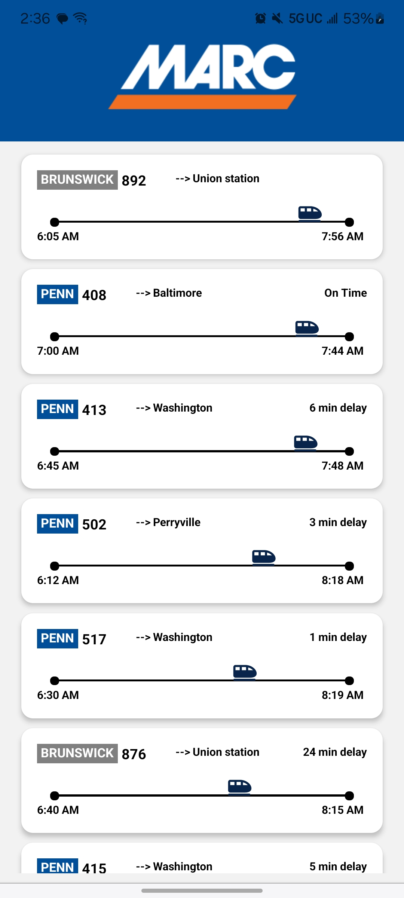
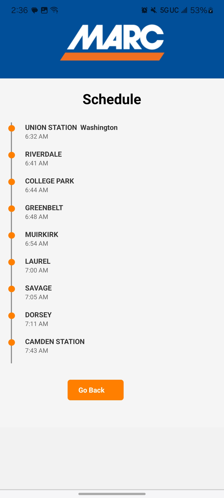

HiMARC Train Tracker

HiMARC Train Tracker is an Android app that provides real-time status updates, schedules, delays, and service alerts for MARC trains. Whether you're commuting daily or taking an occasional trip, this app helps you stay informed about your train's status with a clean, user-friendly experience.

📸 Screenshots

📌 Features

✅ Live Train Status – Get real-time updates on train arrivals, departures, and delays.
✅ Schedules – Access up-to-date schedules for all MARC lines.
✅ Service Alerts – Stay informed about disruptions, cancellations, and other service issues.
✅ Interactive Map – Visualize train routes and stops with an intuitive interface.
✅ Favorites – Save frequently used routes for quick access.
✅ Push Notifications – Receive real-time alerts for train delays.

🛠 Tech Stack

Frontend: React Native (Expo)

Backend: Node.js (Express)

Data Storage: SQLite

Axios for fetching data

Protobuf.js for decoding GTFS-RT data

CSV to JSON conversion for processing GTFS static data

🚀 Installation

Clone the repository:

git clone https://github.com/yourusername/marc-train-tracker.git
cd marc-train-tracker

Install dependencies:

npm install

Run the server:

node server.js

📡 API Endpoints

Fetch Live Train Data

GET /api/live-trains

Returns real-time train delay updates.

Fetch Daily Train Schedule

GET /api/schedule

Returns the full daily train schedule.

Subscribe to Train Alerts

POST /api/subscribe

Request body:

{
  "train_id": "12345",
  "push_token": "ExponentPushToken[abcdefg]"
}

Subscribes a user to push notifications for a specific train.

🔍 How It Works

GTFS-RT Data Fetching:

Uses protobuf.js to decode the real-time GTFS feed.

Extracts trip updates, delays, and service alerts.

GTFS Static Data Processing:

Downloads and extracts the latest GTFS schedule ZIP.

Converts CSV files (stops, trips, routes, stop_times) to JSON.

Joins schedule data for structured output.

Mobile App Experience:

Displays real-time train status in an intuitive UI.

Allows users to subscribe to alerts for specific trains.

Provides a searchable schedule with delay indicators.

Features an interactive map for route visualization.

Saves favorite routes for quick access.

Push Notifications:

Uses Expo SDK to send delay alerts to subscribers.

Stores subscription data in an SQLite database.
